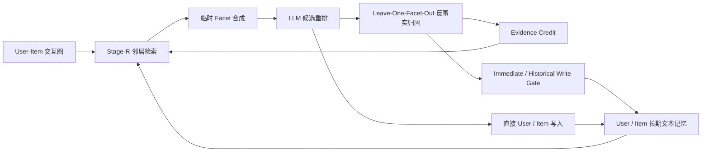

# MemEvoRec

MemEvoRec 是一个面向推荐 Agent 的反馈驱动长期记忆系统。项目关注的不是继续扩大提示词，而是让 Agent 在多轮交互中回答三个更具体的问题：哪些协同证据真正帮助了推荐、哪些记忆值得继续读取、哪些负贡献信息不应再向邻居传播。

当前实现以 User–Item 协作记忆为长期状态，将一次推理中生成的 preference facet 作为临时证据包，通过反事实排名差异把结果信用回传给真实参与推理的邻居关系，形成完整的：

```text
检索 → 推理 → 写入 → 结果反馈 → 信用更新 → 下一轮检索
```

本仓库侧重记忆机制、反馈闭环、审计协议与可复现实验，不包含模型权重和原始数据集。

## 项目动机

协同记忆可以帮助推荐 Agent 利用相似用户和关联物品的信息，但也会带来一个长期风险：错误或无关信息一旦写入记忆，可能在后续 Episode 中被反复读取和传播。

MemEvoRec 将系统拆分为两个逻辑角色：

- `LM_Mem`：在后台维护 User/Item 文本记忆、协作关系和高信号 preference facets；
- `LLM_Rec`：消费经过筛选的上下文，对固定候选集完成最终排序。

这种拆分把记忆管理与推荐推理解耦。当前本地实验为了控制变量，由同一个 Qwen2.5-7B-Instruct 服务承担两个逻辑角色，但两类职责、输入和状态仍保持分离。

## 闭环如何工作



系统明确区分长期状态和单次推理状态：

| 状态 | 内容 | 是否跨 Episode 保留 |
|---|---|---:|
| 长期记忆 | User memory、Item memory | 是 |
| 长期信用 | Target-conditional evidence credit | 是 |
| 协作图 | User–Item 关系及邻居检索依据 | 是 |
| 临时证据 | synthesized facets、prompt context | 否 |
| 审计事件 | attribution、read、write-gate、hash 日志 | 仅作为实验记录 |

Facet 不会被写成新的长期记忆节点。它只负责承载本轮归因，信用更新完成后即可丢弃。

## 核心机制

### 1. Target-Conditional Evidence Credit

协同证据的价值与目标用户相关，因此信用不是全局的 neighbor score，而是：

```text
(target_user_id, evidence_type, evidence_id) → q
```

同一个邻居可以对用户 A 有帮助、对用户 B 无效。信用记录独立于 User/Item 文本存储和原始交互图，避免一次实验功能演变成整体存储架构重构。

### 2. 逐 Facet 反事实归因

对本轮生成的每条 facet 分别执行 leave-one-out 重排：

```text
delta_f = NDCG@10(F) - NDCG@10(F \ {f})
```

只有 facet 声明的 supporting neighbor 与实际 packed relations 相交时，关系才会获得信用。LLM 自报的来源仅作为候选解释，不能直接充当归因真值。

### 3. 信用感知读取

下一轮检索在原有邻居分数上加入历史信用：

```text
adjusted_score = original_score × clip(1 + λq, 0.5, 1.5)
```

当 `q=0` 时严格退化为原检索行为，便于进行 Read Credit 消融。

### 4. 自适应写入门控

协同传播使用当前 Episode 和历史信用共同决策：

```python
if has_current_attribution and raw_episode_delta < 0:
    reject("negative_current_episode_contribution")
elif num_updates >= 2 and historical_q < -0.3:
    reject("negative_historical_credit")
else:
    accept("neutral_or_exploration")
```

门控只阻断本轮的间接 neighbor propagation。目标用户和真实交互物品产生的 direct writes 始终保留，避免因为协同证据表现不佳而丢失真实行为事实。

### 5. Dynamic Neighbor Memory Read

V1.2 打通了 `Stage-W 写入 → 后续 Stage-R 读取`。Stage-R 在不改变原邻居 ID、数量、顺序和静态摘要的前提下，附加已经写入的邻居长期文本记忆：

- 每条动态记忆最多 64 tokens；
- 每轮动态记忆总预算 512 tokens；
- Stage-R 完整上下文不超过 1800 tokens；
- 使用确定性 head-tail 截断；
- 通过内容 hash 执行 read-after-write 一致性校验。

## 版本演进

| 版本 | 主要变化 | 解决的问题 |
|---|---|---|
| Corrected | 修复 warmup 阶段未返回 facets/子图详情的问题 | 确保 Stage-W 获得真实推理证据 |
| V1.0 | 加入 Evidence Credit、反事实归因和历史信用门控 | 建立结果反馈闭环 |
| V1.1 | 写入门控增加当前 Episode 的原始负贡献判断 | 稀疏关系很少重复，单靠历史阈值几乎不会触发 |
| V1.2 | Stage-R 开始读取 Stage-W 写入的动态邻居记忆 | 让长期协同记忆真正进入后续决策路径 |

## 代码导航

```text
src/
├── data/                         # 数据划分、候选采样
├── memory/
│   ├── graph.py                  # User-Item 协作关系
│   ├── storage.py                # User/Item 长期文本记忆
│   ├── evidence_credit.py        # Target-conditional 信用存储
│   ├── feedback_controller.py    # 反事实归因、信用更新与审计事件
│   ├── pruner.py                 # 邻居筛选与 Read Credit
│   └── packer.py                 # 静态/动态记忆预算打包
├── models/
│   └── memrec_agent.py           # Retrieve-Reason-Write 主流程
└── train/
    └── trainer_memrec.py         # warmup、predict-before-write、冻结测试

configs/                          # 四组锁定的 V1.2 300-user 独立配置
scripts/                          # 运行、验收与统计脚本
docs/                             # 设计、协议、审计和实验报告
outputs/                          # 精简汇总与逐用户统计
```

## 环境与数据

推荐环境：Python 3.10、CUDA 12.1+、PyTorch、Transformers、vLLM。

```bash
conda env create -f env/environment.yml
conda activate memrec
pip install -r requirements.txt
pip install vllm
```

原始数据不随仓库分发。将 InstructRec 数据放入 `data/iagent/` 后执行：

```bash
bash scripts/convert_all_instructrec.sh
```

正式实验使用 `instructrec-books` 的固定 300-user 清单：

```text
data/eval_user_samples/strict_books_v12_300_seed45.json
```

## 启动本地模型服务

模型权重需自行准备到：

```text
models/Qwen2.5-7B-Instruct
```

双卡实验使用两个独立 vLLM 服务，每个实验内部仍按用户严格串行：

```bash
export NO_PROXY=127.0.0.1,localhost
export no_proxy=127.0.0.1,localhost
unset HTTP_PROXY HTTPS_PROXY ALL_PROXY
unset http_proxy https_proxy all_proxy

CUDA_VISIBLE_DEVICES=0 vllm serve models/Qwen2.5-7B-Instruct \
  --host 127.0.0.1 --port 8000 \
  --dtype half --max-model-len 8192 \
  --gpu-memory-utilization 0.88 --seed 42 \
  --enforce-eager --api-key local-vllm \
  --generation-config vllm

CUDA_VISIBLE_DEVICES=1 vllm serve models/Qwen2.5-7B-Instruct \
  --host 127.0.0.1 --port 8001 \
  --dtype half --max-model-len 8192 \
  --gpu-memory-utilization 0.88 --seed 42 \
  --enforce-eager --api-key local-vllm \
  --generation-config vllm
```

## 四组 300-user 配置

| 配置 | 动态邻居记忆 | Evidence Credit | Read Credit | Write Gate |
|---|---:|---:|---:|---:|
| `feedback_memrec_books_v12_300_corrected.yaml` | 关闭 | 关闭 | 关闭 | 关闭 |
| `feedback_memrec_books_v12_300_memory_only.yaml` | 开启 | 关闭 | 关闭 | 关闭 |
| `feedback_memrec_books_v12_300_read.yaml` | 开启 | 开启 | 开启 | 关闭 |
| `feedback_memrec_books_v12_300_full.yaml` | 开启 | 开启 | 开启 | 开启 |

以 Full V1.2 为例：

```bash
python scripts/run_train.py \
  --model memrec_agent \
  --dataset instructrec-books \
  --config configs/feedback_memrec_books_v12_300_full.yaml \
  --device cuda:0 \
  --output_dir outputs/feedback_memrec_v12_continuous_300_full
```

正式协议是：

```text
300-user warmup → 保存 memory_after_warmup → 300-user frozen-credit test
```

测试阶段严格采用 `predict → evaluate → update`，并要求 `credit_updates_during_test=0`，防止当前标签进入当前预测。

## 300-user 消融结果

本地实验使用 Qwen2.5-7B-Instruct、10-item sampled reranking 和固定 seed。排名失败按预注册协议计 0：

| Variant | 成功排名 | Hit@1 | Hit@3 | Hit@5 | NDCG@10 |
|---|---:|---:|---:|---:|---:|
| Corrected | 296/300 | 0.4167 | 0.6500 | 0.7600 | 0.669025 |
| Memory Only | 295/300 | 0.4300 | 0.6567 | 0.7533 | 0.671417 |
| Closed-loop Read | 295/300 | 0.4300 | 0.6600 | 0.7667 | 0.674103 |
| Full V1.2 | 295/300 | 0.4233 | 0.6433 | 0.7567 | 0.668487 |

配对统计结论：

- `Memory Only − Corrected = +0.002392`；
- `Read − Memory Only = +0.002686`；
- `Full − Read = -0.005616`；
- 三项 NDCG@10 比较的 bootstrap 95% CI 均跨过 0。

因此，这组实验支持“闭环机制可运行、可审计、能改变长期状态”，但没有证明 Full V1.2 在该数据、用户序列和模型 seed 下稳定提升排序质量。

## 机制验收结果

除了最终排名，项目还验证长期状态是否按设计流动：

- 四组 candidate manifest 一致；
- 四组测试期信用更新均为 0；
- Full 拒绝 145/1341 次协同传播，其中 item neighbor 102 次、user neighbor 43 次；
- 1052/1052 次 direct writes 全部保留；
- 共打包 3099 条动态邻居记忆；
- read-after-write hash mismatch 为 0；
- Full 的 Stage-R 上下文 token 数为 778 / 1302.8 / 1586（min/mean/max），未超过 1800 上限。

详细结果见：

- `docs/feedback_memrec_v12_300_experiment_report.md`
- `outputs/feedback_memrec_v12_300_summary.json`
- `outputs/feedback_memrec_v12_300_per_user.csv`
- `outputs/feedback_memrec_v12_300_paired_statistics.json`

## 实验边界

- 当前结论来自单数据集、固定 300-user 顺序和单模型 seed；
- 任务是包含一个正样本的 10-item 重排，不是全库召回；
- `Hit@10` 在十候选设置下信息量有限，因此不作为核心效果指标；
- V1.1 的两个 100-user block 提供阶段性正向证据，但不能替代更大规模、多 seed 验证；
- LLM 偶发 JSON 截断会产生孤立 ranking failure，报告同时保留 all-user 与 common-success 口径；
- 本项目更新的是外部文本记忆和证据信用，不训练或修改 Qwen 模型参数。

## 研究来源与说明

本项目围绕协作记忆增强推荐继续探索反馈归因和长期状态演化。记忆管理与推荐推理解耦、协作记忆图以及 `LM_Mem / LLM_Rec` 的角色划分受到 [MemRec](https://github.com/rutgerswiselab/MemRec) 工作启发；本仓库新增的重点是 Evidence Credit、逐 facet 反事实归因、自适应写入门控、动态邻居记忆回读和对应的审计实验。

如果复用相关研究实现或实验设计，请同时查阅上游论文、仓库说明以及本项目 `docs/` 中记录的实验边界。
